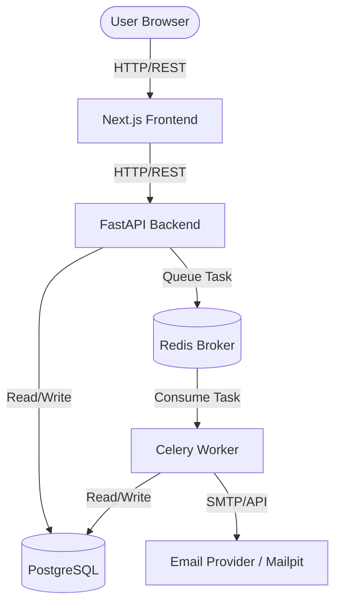

# Architecture

This document outlines the architecture for the Mail Merge Platform.

## High-Level Flow

## Component Roles

1. **Next.js Frontend**: The UI for users and admins. Communicates with the FastAPI backend.
2. **FastAPI Backend**: The core API server. Handles authentication, campaign management, file parsing, and pushing tasks to Redis.
3. **PostgreSQL**: The source of truth for all data (Users, Campaigns, Contacts, Tracking, Scheduled Jobs).
4. **Redis**: In-memory message broker used by Celery to queue tasks (e.g., sending emails).
5. **Celery Worker**: Background processes that pick up jobs from Redis, execute them (like sending an email or checking follow-ups), update the database, and handle retries.
6. **Email Provider**: The service actually sending the emails (SMTP, SES, SendGrid, etc.). For local development, we use Mailpit to catch all outgoing emails.

## Key Architectural Principles
- **Persistent Scheduling**: Scheduled jobs are persisted in PostgreSQL. Redis/Celery is just the execution engine, enabling recovery from crashes.
- **Idempotent Sending**: Duplicate send protection is enforced via DB constraints and state checks.
- **Event History**: Granular events are tracked for debugging and analytics.
- **Provider Abstraction**: Business logic is decoupled from specific email providers.
